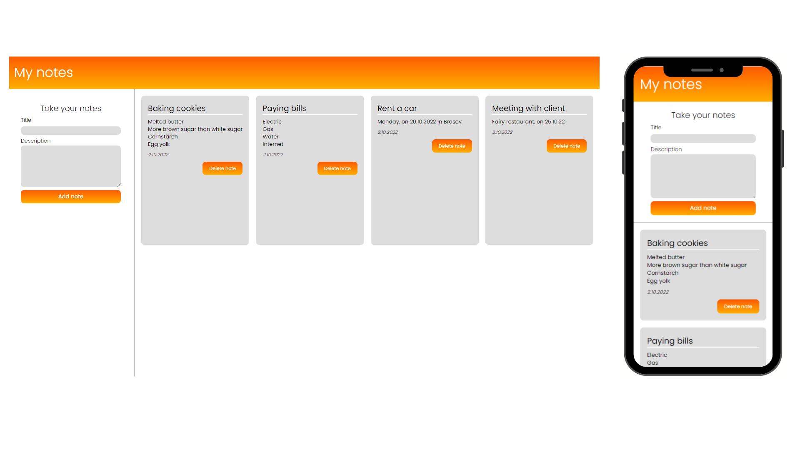

# Responsive Note Taker using HTML, CSS and Javascript

This project is a basic application that can be used to write, save and delete notes, using local storage.

## Getting started

$ git clone: https://github.com/BiancaMarin/My-Notes-Taking-App.git

## Illustration

